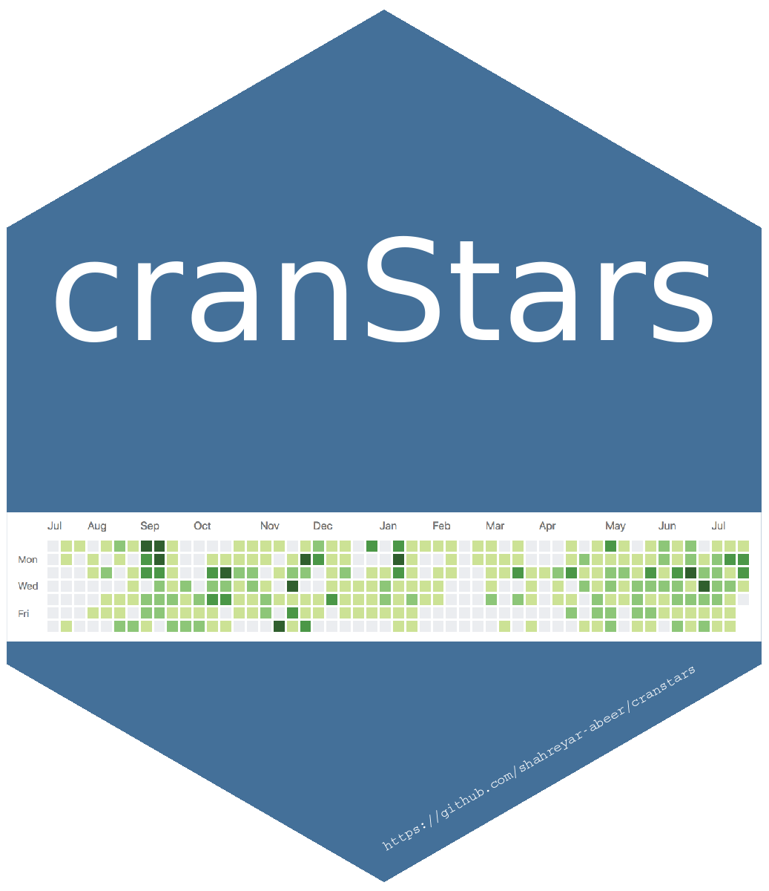

<!-- badges: start -->
[](https://www.tidyverse.org/lifecycle/#experimental)
[](https://github.com/shahreyar-abeer/cranstars/actions)
[](https://codecov.io/gh/shahreyar-abeer/cranstars)
<!-- badges: end -->  


# cranstars 

`{cranstars}` is simple shiny app that given a package name, shows CRAN downloads &amp; github star statistics.  
This is developed with the {golem} framework.

App available at <https://shahreyar-abeer.shinyapps.io/cranstars/>  


The following is a [feedback](https://twitter.com/_ColinFay/status/1319188197759459328) given by [Colin Fay](https://twitter.com/_ColinFay) from [Thinkr](https://thinkr.fr/)


## Installing & Running

Install `{cranstars}` on your machine with:

``` r
# Install
devtools::install_github("shahreyar-abeer/cranstars")

# Run
cranstars::run_app()
```


Please note that the ‘cranstars’ project is released with a [Contributor
Code of Conduct](inst/CODE_OF_CONDUCT.md). By contributing to this project,
you agree to abide by its terms.  

